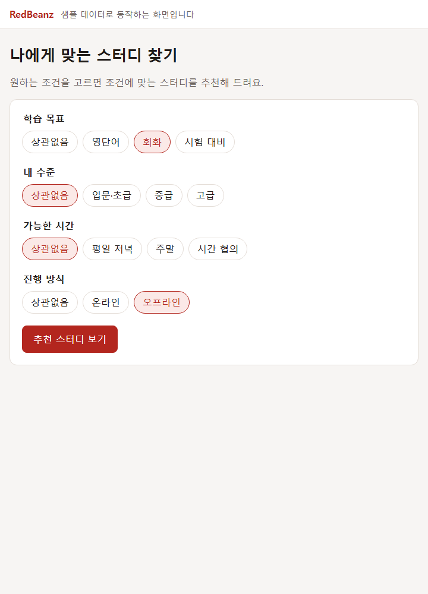
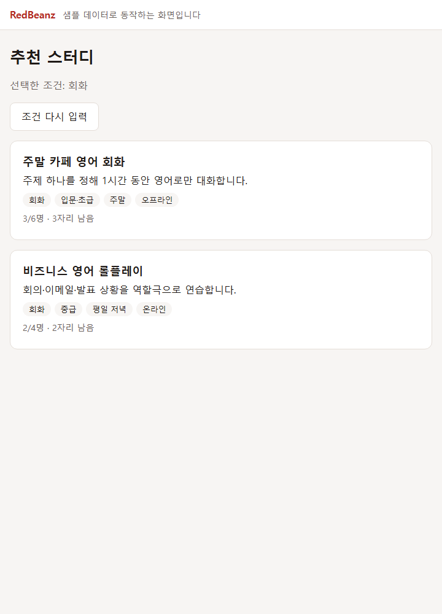
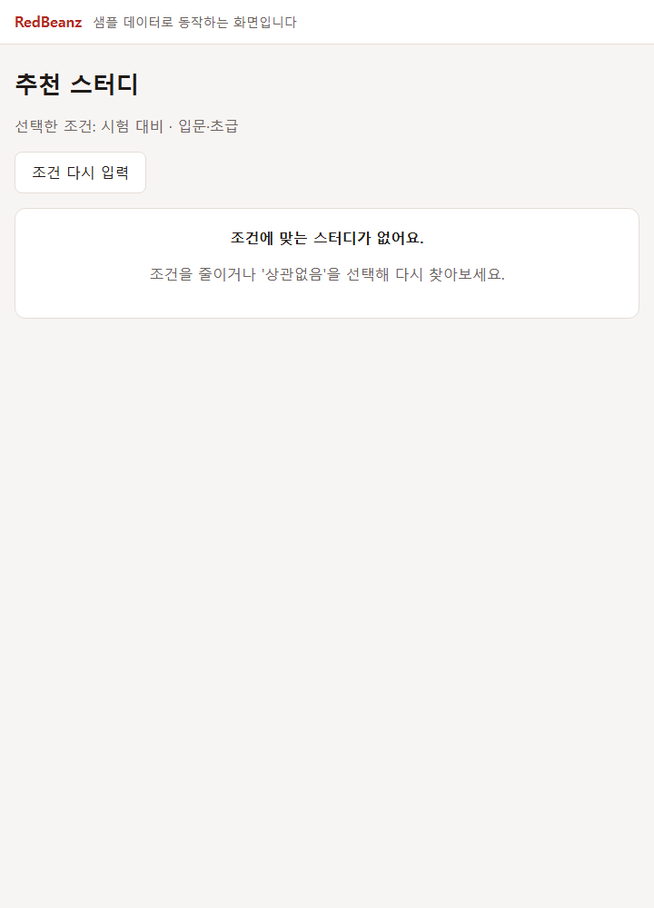
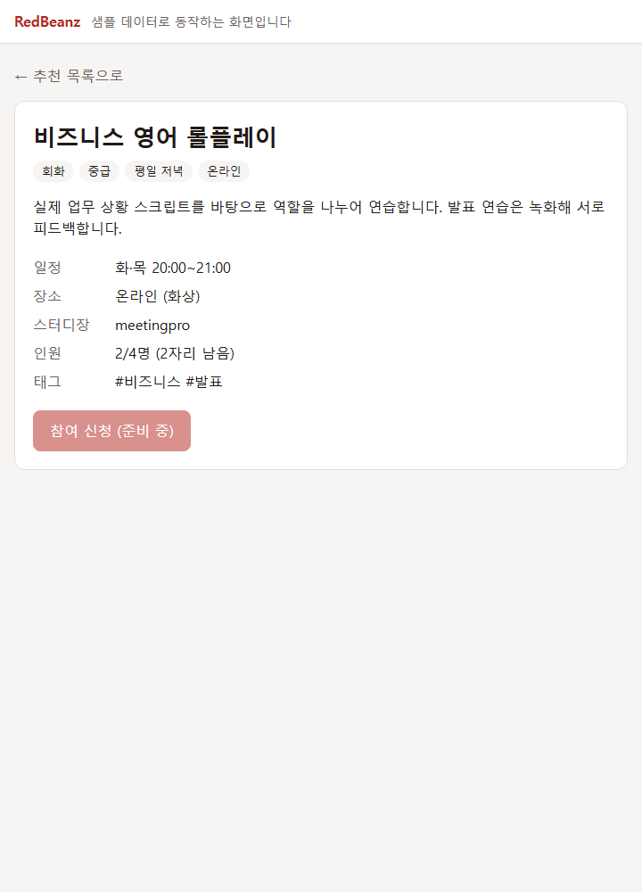

# 스터디 탐색 화면 흐름 — Sprint 1 초안

관련 이슈: [Front #1](https://github.com/DKU-RedBeanz/Web-1-Front/issues/1)

`스터디 조건 입력 → 추천 목록 → 스터디 상세` 흐름을 샘플 데이터(`src/data/sampleStudies.ts`)로 구성했습니다. 아래 조건·표시 정보는 **기획 초안**이며, 실제 API 경로와 응답 형식은 백엔드와 함께 확정합니다.

## 화면과 경로

| 화면 | 경로 | 설명 |
|---|---|---|
| 조건 입력 | `/` | 네 가지 조건을 고릅니다. 각 조건에 '상관없음'을 선택할 수 있습니다. |
| 추천 목록 | `/studies?goal=&level=&time=&mode=` | 선택한 조건을 URL 쿼리로 전달합니다. 결과가 없으면 빈 상태를 표시합니다. |
| 스터디 상세 | `/studies/:studyId` | 목록의 조건 쿼리를 유지해 '추천 목록으로' 돌아갈 수 있습니다. |

조건을 URL에 담았기 때문에 새로고침하거나 링크를 공유해도 같은 결과가 나옵니다.

## 조건 후보 (초안)

| 조건 | 값 | 비고 |
|---|---|---|
| 학습 목표 `goal` | 영단어 `vocabulary` · 회화 `conversation` · 시험 대비 `exam` | 서비스의 AI 학습 영역(영단어·회화)에 맞춤 |
| 수준 `level` | 입문·초급 `beginner` · 중급 `intermediate` · 고급 `advanced` | 수준 측정 방법은 미정 |
| 가능한 시간 `time` | 평일 저녁 · 주말 · 시간 협의 | 요일·시간대를 더 세분화할지 논의 필요 |
| 진행 방식 `mode` | 온라인 · 오프라인 | 오프라인은 지역 조건 필요 여부 논의 |

## 임시 추천 방식

`src/utils/recommend.ts` — 선택한 조건이 **모두 일치**하는 스터디만 보여주고, 남은 자리가 많은 순으로 정렬합니다. '상관없음'인 조건은 비교하지 않습니다. 실제 추천 기준(AI 사용 여부 포함)은 추후 확정하며 이 함수를 API 호출로 교체할 예정입니다.

## 화면별 필요한 정보

### 조건 입력

- 조건 종류와 선택지 목록 — 지금은 프론트에 고정. 백엔드에서 내려줄지 결정 필요
- (추후) 로그인 사용자의 기존 수준·선호 조건으로 기본값 채우기

### 추천 목록 (스터디 1건당)

| 필드 | 타입 (초안) | 용도 |
|---|---|---|
| `id` | number | 상세 이동 |
| `title` | string | 제목 |
| `summary` | string | 한 줄 소개 |
| `goal` · `level` · `time` · `mode` | enum 문자열 | 조건 배지 |
| `memberCount` · `capacity` | number | 인원·남은 자리·모집 마감 표시 |

### 스터디 상세

목록 필드에 더해 다음이 필요합니다.

| 필드 | 타입 (초안) | 용도 |
|---|---|---|
| `description` | string | 상세 소개 |
| `schedule` | string | 모임 일정 (자유 텍스트) |
| `location` | string | 온라인 도구 또는 오프라인 장소 |
| `leaderNickname` | string | 스터디장 |
| `tags` | string[] | 키워드 |

참여 신청 버튼은 신청·승인 방식이 미정이라 비활성 상태로만 표시했습니다.

## 백엔드에 드릴 질문

1. **API 형태**: 추천 목록을 `GET` + 쿼리 파라미터(예: `?goal=...&level=...`)로 받을 수 있을까요? 경로 이름은 백엔드에서 정해 주시면 맞추겠습니다.
2. **조건 값 표현**: 조건을 영문 enum 문자열(`vocabulary` 등)로 주고받아도 될까요? 선택지 목록을 프론트에 고정할지, API로 받을지도 정하고 싶습니다.
3. **ID 타입**: 스터디 ID는 숫자(Long)인가요, UUID 같은 문자열인가요?
4. **일정 표현**: `schedule`을 자유 텍스트로 둘지, 요일·시작/종료 시간으로 나눌지 궁금합니다. 나누면 시간 조건 필터가 정확해집니다.
5. **인원 정보**: 현재 인원을 응답에 포함해 주실 수 있을까요? 아니면 참여 관계 테이블에서 계산하나요?
6. **추천 결과 없음**: 결과가 없을 때 빈 배열 + 200으로 주시면 프론트에서 빈 상태로 처리하겠습니다. 괜찮을까요?
7. **로그인 필요 여부**: 추천 목록·상세를 비로그인 사용자도 볼 수 있나요? (Security 공개 경로와 연결)
8. **오류 응답 형식**: 존재하지 않는 스터디 ID는 404와 어떤 본문 형식으로 오나요?
9. **페이지네이션**: 추천 결과 수가 많아질 경우 페이지 단위로 받을지 궁금합니다.
10. **참여 신청**: 신청 → 승인 방식인지 바로 가입인지, 정원이 찬 스터디는 목록에서 제외할지 정해야 합니다.

## 이번 범위에서 제외

실제 백엔드 API 호출, 추천 알고리즘, AI API, 로그인, 참여 신청 처리, 채팅·댓글, 배포.

## 실행 화면

| 조건 입력 | 추천 목록 |
|---|---|
|  |  |

| 결과 없음 | 스터디 상세 |
|---|---|
|  |  |
